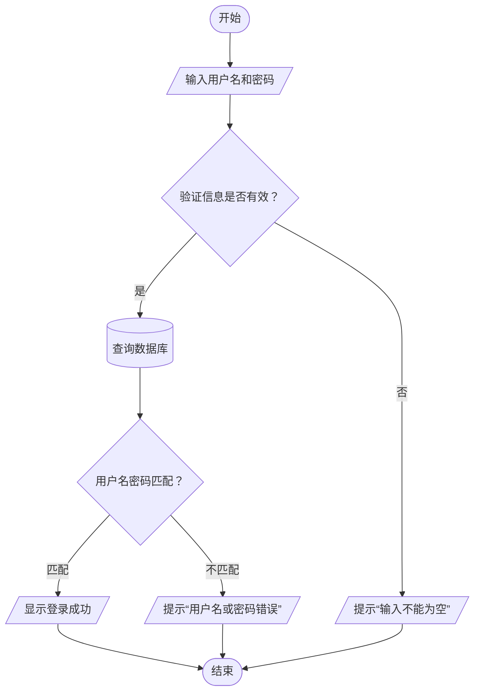

## 状态机与流程图知识点大全

---

### 第一部分：状态机（State Machine）

#### 1. 什么是状态机？
状态机是一种用于描述系统行为的数学模型，它由**有限个状态**、**事件**以及**状态之间的转换**组成。系统在任何时刻都处于某一个**稳定状态**，当有**事件**发生时，根据当前状态和事件，系统可能执行某些**动作**并迁移到另一个状态。

#### 2. 核心概念
- **状态（State）**：系统在某一时刻的稳定模式，如“空闲”、“前进”。
- **事件（Event）**：触发状态转换的外部或内部输入，如传感器信号、定时器超时。
- **转换（Transition）**：从一个状态到另一个状态的迁移，通常由事件触发，可能伴有守卫条件和动作。
- **动作（Action）**：在进入/退出状态或在转换过程中执行的操作，如启动电机。
- **守卫条件（Guard）**：转换前必须满足的布尔条件，只有条件为真时转换才发生。

#### 3. 有限状态机（FSM）
- 状态数量有限，一次只处于一个状态。
- 数学定义：五元组（状态集、输入集、转换函数、初始状态、终态集）。

#### 4. 状态图（State Diagram）
- **定义**：UML中用于可视化状态机的图形工具，是状态机的“设计图纸”。
- **与状态机的关系**：状态图是状态机的可视化表达，代码实现是状态机的文本化表达。状态机是抽象模型，状态图是模型的可视化，代码是模型的具体实现。

#### 5. UML状态图规范

| 符号 | 名称 | 含义 |
|------|------|------|
| 圆角矩形 | 状态 | 表示一个状态，内部可写 `entry/动作`、`exit/动作`、`do/活动` |
| 实心圆 | 初始状态 | 状态机开始的地方，一个图只有一个 |
| 实心圆外套圆圈 | 终止状态 | 状态机执行结束 |
| 带箭头实线 | 转换 | 从源状态指向目标状态，可标注 `事件[守卫]/动作` |
| 空心菱形 | 判断节点 | 实现分支逻辑 |
| 圆圈内 H | 浅历史 | 记住组合状态直接子状态的历史 |
| 圆圈内 H* | 深历史 | 递归记住所有嵌套子状态的历史 |

- **层次状态（Composite State）**：状态内部可以嵌套子状态，用于处理复杂行为。
- **历史状态**：当再次进入组合状态时，可以从上次离开的子状态继续，而不是从初始状态开始。

#### 6. 状态机实现方法（C++示例）

**方法1：switch-case（简单）**
```cpp
enum State { IDLE, FORWARD, AVOID };
State current = IDLE;
void handleEvent(Event e) {
    switch(current) {
        case IDLE: if (e == START) { /* 动作 */ current = FORWARD; } break;
        // ...
    }
}
```

**方法2：状态模式（推荐）**
- **抽象状态基类**：定义 `entry()`、`exit()`、`handleEvent()` 纯虚函数。
- **具体状态类**：继承基类，实现各自行为。
- **上下文类**：持有当前状态指针（`std::unique_ptr<State>`），提供 `transitionTo()` 和 `handleEvent()`。
- **优点**：每个状态独立，易于扩展，符合开闭原则。

**方法3：状态表驱动**
- 用二维数组存储转换表：`nextState[currState][event]`，表中可包含动作函数指针。
- 执行时查表跳转，效率高，适合状态转换固定的场景。

**方法4：现成库**（Boost.MSM、Qt State Machine、SMC等）支持层次状态、历史状态等高级特性。

---

### 第二部分：流程图（Flowchart）

#### 1. 什么是流程图？
流程图是一种描述**过程、算法或工作流步骤序列**的图形化工具，关注“如何做”（How）。它展示控制流的顺序、分支、循环。

#### 2. 核心符号表（国际标准）

| 符号 | 名称 | 用途 |
|------|------|------|
| 椭圆形 | 起止符号 | 表示流程的开始或结束 |
| 矩形 | 处理/操作 | 表示一个具体的处理步骤（动词+名词） |
| 菱形 | 判断/决策 | 表示条件分支，引出“是/否”等分支 |
| 平行四边形 | 输入/输出 | 表示数据输入（如读取）或输出（如显示） |
| 带箭头直线 | 流程线 | 指示流程方向 |
| 圆形 | 连接符 | 用于跨页连接或避免线条交叉 |
| 括号 | 注释 | 对某步骤进行补充说明 |
| 矩形内加双竖线 | 子流程 | 表示一个预定义的独立子流程 |

#### 3. 绘制规范
- **方向**：从上到下、从左到右排列，流程线必须带箭头。
- **逻辑**：
  - 单一起点，可以有多个终点。
  - 每个判断分支必须完整，最终都到达结束点或连接点。
  - 除判断节点外，其他处理节点最好只有一个流入一个流出。
- **命名**：处理节点用“动词+名词”，判断节点用清晰可量化的问题。
- **布局**：符号大小一致，对齐整齐，避免交叉线，可适当使用连接符。

#### 4. 流程图示例：用户登录验证


---

### 第三部分：状态图 vs 流程图

| 维度 | 状态图 | 流程图 |
|------|--------|--------|
| **核心思想** | 对象生命周期、事件驱动 | 步骤序列、过程驱动 |
| **驱动力** | 事件（消息、信号） | 控制流（顺序、分支、循环） |
| **系统行为** | 被动响应，驻留在状态中等待事件 | 主动执行，按步骤推进 |
| **表达力** | 状态、转换、事件、动作、历史 | 步骤、判断、输入输出 |
| **适用场景** | 对象行为建模（机器人、协议、UI） | 算法、业务流程、操作说明 |
| **层次性** | 原生支持嵌套状态 | 通过子流程实现分层 |
| **时间概念** | 状态可驻留任意长时间 | 步骤顺序隐含时间，但不强调驻留 |

**一句话区分**：  
- 用**状态图**描述“**在什么状态下，遇到什么事，该做什么**”（行为设计）。  
- 用**流程图**描述“**为了解决某个问题，需要依次执行哪些步骤**”（操作说明书）。

---

